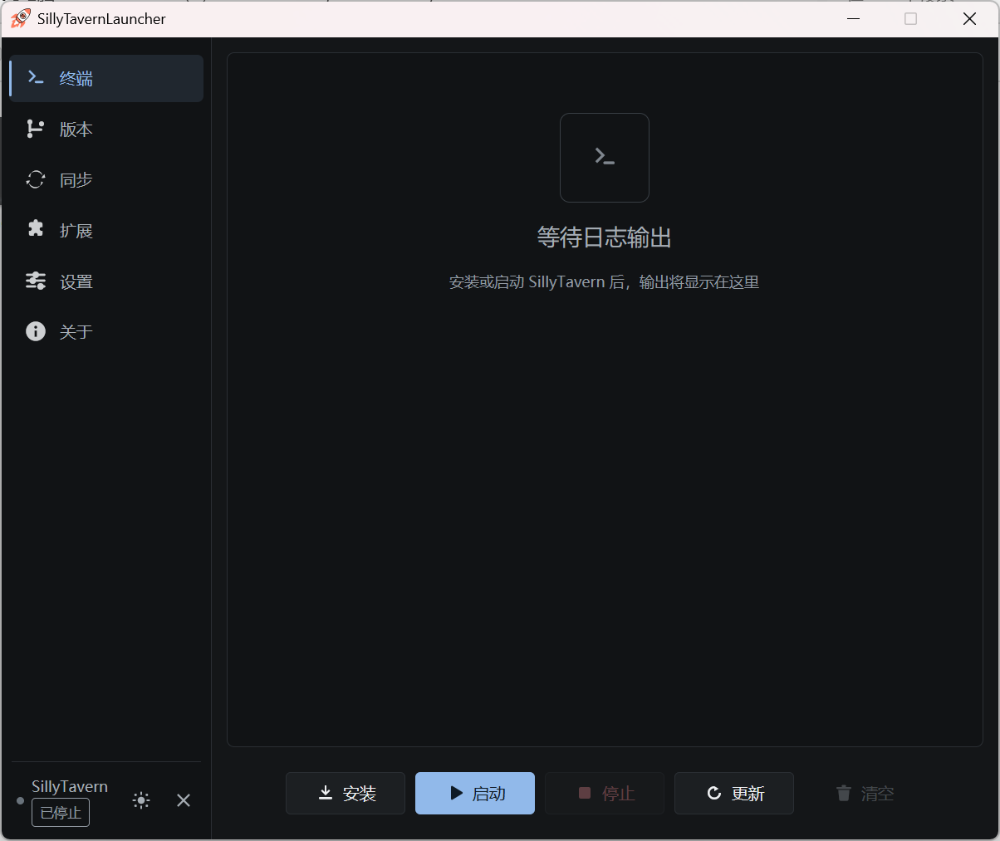

# SillyTavernLauncher

[](LICENSE) [](https://github.com/LingyeSoul/SillyTavernLauncher/releases)

> 🧠 **智能启动管理器** | [SillyTavern](https://github.com/SillyTavern/SillyTavern) 的现代化 GUI 解决方案

# 📜 免责声明与合规说明
SillyTavernLauncher 仅为 SillyTavern 应用的启动管理工具（GUI 启动器），不涉及任何内容生成、提示词修改或内容审核功能，不参与主程序任何核心功能的运行，本项目本身不参与任何信息内容的生成、存储、传播环节。通过本启动器使用 SillyTavern 时，用户须严格遵守《中华人民共和国网络安全法》《生成式人工智能服务管理暂行办法》等国家相关法律法规，同时遵守 SillyTavern 主程序的用户协议，确保生成和传播的内容合法合规，严禁利用本工具规避合规要求，严禁用于生成或传播淫秽色情、暴力恐怖、赌博诈骗、造谣传谣等违法不良信息。作为工具提供方，我们不对用户通过本启动器使用 SillyTavern 所产生的任何内容承担法律责任，内容安全、信息合规等相关责任完全由用户自行承担。关于日志功能：本启动器的日志记录功能仅用于技术故障排查、运行状态监控、功能优化，日志收集的范围严格限定为 SillyTavern 软件运行层面的技术数据（如进程 ID、接口调用记录、错误代码、系统环境参数等），不主动收集任何用户的隐私信息、内容交互数据（如聊天内容）、身份信息（如账号、手机号）；日志数据默认存储在用户本地设备指定目录（启动器路径/logs/），仅保存在用户本地，本启动器不会主动上传、同步、分享日志数据至任何第三方服务器，用户可随时删除；用户使用日志功能时，应严格遵守相关法律法规，不得利用日志功能收集、存储、传播他人的隐私信息、敏感个人信息或用于非法用途。请用户在使用过程中自觉履行网络安全义务，遵守公序良俗，共同维护清朗网络环境。

## ✨ v2.0 新特性（GPUIX 重写版）

- 🎨 **GPUIX 原生 GPU 界面** - 基于 `@gpuix/react` + `@gpuix/native` 重构，GPU 渲染原生 UI，启动更快、渲染更流畅
- ⚡ **TypeScript 全栈重写** - 从 Python/Flet 迁移到 TypeScript（strict）+ React 19，类型安全、工程化测试
- 🗂️ **版本管理** - GitHub tag 历史版本列表，一键切换 SillyTavern 版本
- 🔄 **局域网数据同步** - 服务器/客户端模式，Token 鉴权与增量同步，多设备无缝切换
- ⚙️ **SillyTavern 配置管理** - 可视化管理监听端口、请求代理、白名单（智能子网 / unified 模式）
- 🧩 **扩展管理** - SillyTavern 扩展一键安装与卸载，镜像源加速
- 🧪 **完整测试体系** - Vitest 单元测试 + 真实 GPU 窗口 E2E 测试
- 🛡️ **国内网络容错** - GitHub 镜像源、TLS 证书回退、Git schannel 重试

## 核心优势 💎

✅ 一键安装部署
✅ 智能环境检测（懒人包 / 系统 / 内置运行时三模式）
✅ 实时终端监控（ANSI 彩色日志）
✅ 历史版本管理与一键切换
✅ 局域网数据同步（Token 鉴权 + 增量同步）
✅ 扩展管理与镜像加速
✅ 国内网络优化（镜像源 / TLS 回退）

## 界面预览 🖼️

<div align="center">
  
</div>

## 技术栈 🧰

- 🟨 **TypeScript (strict)** - 核心编程语言
- ⚛️ **React 19** - UI 组件模型
- 🎨 **GPUIX 0.9**（`@gpuix/react` / `@gpuix/native`）- GPU 渲染原生 GUI 框架
- 🥟 **Bun** - 运行时与包管理（生产宿主）
- 🐻 **zustand** - 状态管理
- 🖥️ **@xterm/headless** - 终端仿真与 ANSI 彩色日志解析
- 🗜️ **fflate / yaml** - 同步数据 ZIP 解压 / config.yaml 保留式读写
- 🧪 **Vitest** - 单元测试与 E2E 测试
- 🌐 **Git + Node.js 18+** - SillyTavern 运行依赖（外部）

## 快速开始 🚀

### 方式一：使用懒人包（推荐）

在[下载地址](https://sillytavern.lingyesoul.top/start#%E4%B8%8B%E8%BD%BD%E6%B8%A0%E9%81%93)直接下载最新版本的懒人包，解压即可使用，无需配置环境。

### 方式二：使用系统环境模式

在 Release 页面下载，解压后双击 `SillyTavernLauncher.exe` 即可运行，需要系统内安装了 Git 和 Node.js 环境。未安装任何环境的机器也可以在设置页切换为「启动器内置运行时」模式（实验性，无需外部 Git / Node.js）。

### 方式三：从源码运行

```bash
# 克隆仓库
git clone https://github.com/LingyeSoul/SillyTavernLauncher.git
cd SillyTavernLauncher/src

# 安装依赖（需要 Bun）
bun install

# 开发模式运行
bun run dev
```

> 从源码运行需要系统内安装 [Bun](https://bun.sh) 与 Git；启动 SillyTavern 需要 Node.js 18+。依赖安装完成后，也可直接双击仓库根目录的 `start.bat` 以源码方式启动（自动定位安装根目录）。

## 功能特性 🌟

### 🔧 环境管理

启动器支持三种运行环境模式（设置页「环境」一键切换，切换后对安装/启动/更新全链路生效）：

- **内置懒人包环境（portable）**：工具链来自启动器目录旁的 `env/`（便携 Git + Node.js），随懒人包一起分发，开箱即用、不污染系统环境。适合新手与不想折腾环境配置的用户（默认模式）。
- **系统环境（system）**：直接使用系统内已安装的 Git 与 Node.js 18+，机器上已有开发环境的用户无需重复携带工具链，还能配合「修改 Git 配置文件」做镜像源改写。
- **启动器内置运行时（embedded，实验性）**：以打包 exe 内嵌的 Bun 运行时启动 SillyTavern、`bun install` 安装依赖、isomorphic-git 在进程内完成 Git 操作——单文件 exe、零外部依赖。适合无法安装任何环境的机器，或追求极简分发的用户。

> ⚠️ **内置运行时（实验性）兼容性声明**：SillyTavern 官方主运行时为 Node.js，内置模式使用 Bun 运行时，个别功能与扩展可能异常；Git 操作由 isomorphic-git（进程内 JS 实现）完成，极端仓库操作可能失败；依赖安装使用 bun（生成 `bun.lock`），与 npm 存在行为差异。遇到问题请在设置页切换回内置懒人包环境或系统环境。

- 自动检测系统 Git / Node.js（可执行文件探测 + 版本校验，Node ≥ 18）；三种模式按「env/ 目录 → 系统工具链 → 内置运行时」顺序自动探测
- 环境缺失时智能提示与下载引导

### 🎮 服务控制
- 一键安装 / 启动 / 停止 / 更新 SillyTavern，npm 依赖安装走国内镜像
- 更新采用 `git pull --rebase --autostash`，package-lock.json 冲突自动恢复（≤2 次重试）
- 实时终端日志输出（ANSI 彩色，字体与字号可自定义）
- 运行状态自动轮询复位

### 🗂️ 版本管理
- GitHub tag 历史版本列表（含缓存加速）
- 对话框确认后一键切换 SillyTavern 到指定版本

### 📦 局域网数据同步
- 服务器 / 客户端模式，局域网自动发现（并发健康探测）
- Token 鉴权（仅经 Authorization 头传输，不进 URL）
- 选择性同步（角色、聊天记录、世界观等数据目录）
- ZIP 解压带路径穿越防护，保留文件时间戳实现增量同步
- 首次使用引导与实时进度显示

### 🧩 扩展管理
- SillyTavern 扩展一键安装与卸载
- 镜像源加速下载（gh-proxy.org / gh.llkk.cc 可选）

### 🔄 更新管理
- GitHub API 检测启动器与 SillyTavern 更新，更新日志展示
- 镜像源切换（国内加速）；可选改写系统 Git 配置（patchgit）

### ⚙️ SillyTavern 配置管理
- 可视化管理监听端口、请求代理、白名单（智能子网 / unified 模式 / 局域网扫描）
- config.yaml 注释与键序保留式读写；whitelist.txt 一次性迁移
- 监听地址私网过滤自愈（SSRF 防护）

### 🎨 界面特性
- GPUIX 原生 GPU 渲染界面，暗色 / 亮色主题与主题色切换
- 欢迎向导（首次启动：问答 → EULA → 更新检查 → 可选自启）
- 实时状态反馈；本地错误日志（logs/，不上传）
- 进程级异常兜底落盘，便于故障排查

## 开发 🛠️

```bash
cd src

# 类型检查
bun run typecheck

# 单元测试
bunx vitest run --project unit

# E2E 测试（起真实 GPU 窗口，串行执行，需本机图形环境）
bunx vitest run --project e2e

# onefile 打包（门禁 → 图标 → 编译 → 验证 → 冒烟）
# 产物：仓库根 dist/SillyTavernLauncher-<version>-win-x64.exe
# --skip-tests 跳过门禁 / --skip-smoke 无图形环境时跳过冒烟
bun run build:onefile
```

> 仓库根目录的 `build.bat` 是打包的双击入口（参数原样透传）。

项目结构、代码约定与 GPUIX 平台约束详见 [AGENTS.md](AGENTS.md)。
